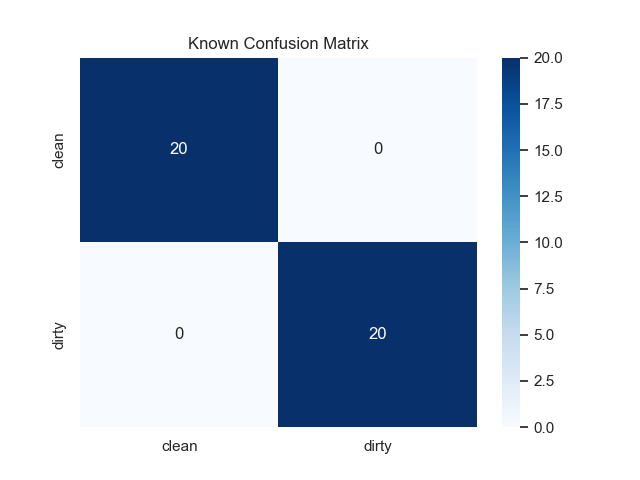
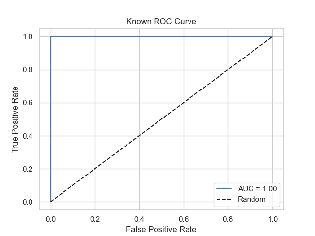
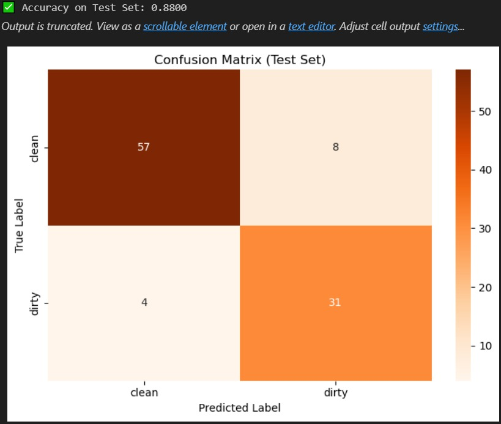

## 🧠 Machine Learning Overview

### 🔍 Feature Extraction

Features were extracted from images using a combination of techniques:

* **Grayscale histogram**
* **Color histogram (RGB, HSV)**
* **Edge detection (Canny)**
* **Texture metrics (Contrast, Luminance)**
* **Shape descriptors (Contours, Area)**

The extracted features were saved in:

```
ML/features/features_train.csv  
ML/features/features_test.csv
```

### 🏗️ Model Pipeline

The classification pipeline consists of:

* **Preprocessing**: Scaling using `StandardScaler`
* **Model**: `RandomForestClassifier` (with GridSearchCV for tuning)
* **Training and Validation** on labeled images (clean/dirty)

Artifacts:

* Trained model: `ML/outputs/final_model.joblib`
* Scaler: `ML/outputs/final_scaler.joblib`

---

### 📊 Performance Metrics

Evaluation was done on a held-out labeled test set.

**Confusion Matrix**


**ROC Curve**


**Confusion Matrix on the test data (100 images)**



Additional metrics:

* **Accuracy**: `XX.XX%`
* **Precision (clean)**: `XX.XX%`
* **Recall (dirty)**: `XX.XX%`
* **AUC**: `0.XX`


---

### 📁 Classification Output

Classified unknown test samples saved to:

```
ML/outputs/classified_unknowns.csv
```

Format:

```csv
filename,label
img001.jpg,clean
img002.jpg,dirty
...
```
